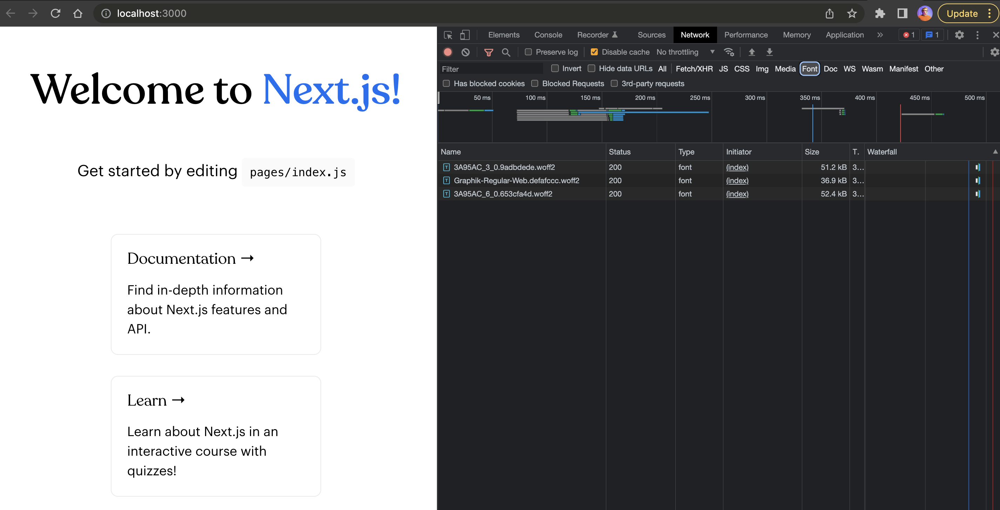
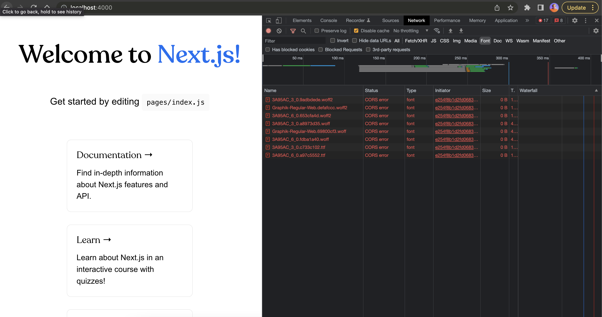
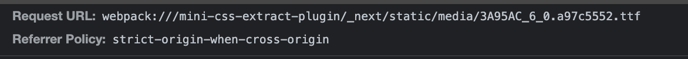

## Bug with locally referred assets from CSS

Referring to npm package with local assets with relative path resolution fails in newer Next.js versions. [See issue #33781](https://github.com/vercel/next.js/issues/33781).

## Working Locally (dev server)



## Not working production

```
yarn build
yarn next start -p 4000
open http://localhost:4000
```



This is the URL generated by Webpack config:



But should be something like `/_next/static/media/3A95AC_3_0.9adbdede.woff2`
