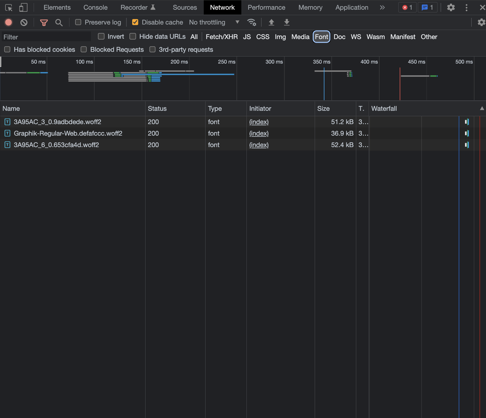

## Bug with locally referred assets from CSS

Referring to npm package with local assets with relative path resolution fails in newer Next.js versions. [See issue #33781](https://github.com/vercel/next.js/issues/33781).

## Working Locally (dev server)



## Not working production

```
yarn build
yarn next start -p 4000
open http://localhost:4000
```


This is the URL generated by Webpack config:


But should be something like `/_next/static/media/3A95AC_3_0.9adbdede.woff2`

## Tests

- `next@10.2.3` Works ✅
- `next@11.1.4` Works ✅
- `next@12.0.0` Works ✅
- `next@12.0.1` Works ✅
- `next@12.0.2` Works ✅
- `next@12.0.3-canary.0` Works ✅
- `next@12.0.3-canary.1` Works ✅
- `next@12.0.3-canary.2` Fails ❌
- `next@12.0.3` Fails ❌
- `next@12.0.10` Fails ❌
- `next@12.1.0` Fails ❌
- `next@12.1.1-canary.1` Fails ❌
